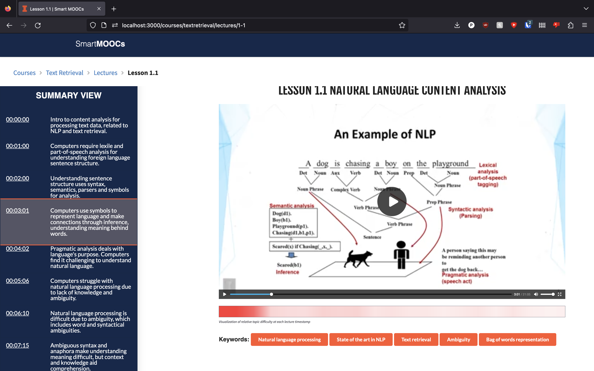

# smartmoocs-chatgpt

This is a project as part of CS 510 Advanced Information Retrieval Spring 2023 course. We have integrated ChatGPT APIs and summarized the SmartMOOCs transcript for the course "Text Retrieval", and are rendering it on the frontend. This project contains both the code for the web interface and the scripts used on ChatGPT to retrieve the summaries.



## Folder structure

```
.
├── chatgpt-video-summary-POC/ (PoC app code)
    ├── app.py (Flask driver code)
    └── templates/index.html (Frontend code)
├── moocs.illinois.edu/ (smartmoocs code)
└── scripts/ (Python scripts for LDA, OpenAI)
    ├── Segments_to_json.ipynb
    ├── SummaryRetrieval.ipynb
    └── TopicModelling.ipynb
```

## Build & Deploy

### Prerequisites
Install npm, node

```
$ brew install node
```

### Build
Execute the following steps in sequence

```
$ cd moocs.illinois.edu/
$ npm install
```
This creates the node_modules/ folder with all the dependencies.

### Deploy

Execute the following command

```
$ npm start dev
```
Then, in your browser open up http://localhost:3000/. The smartmooc website will be rendered.
