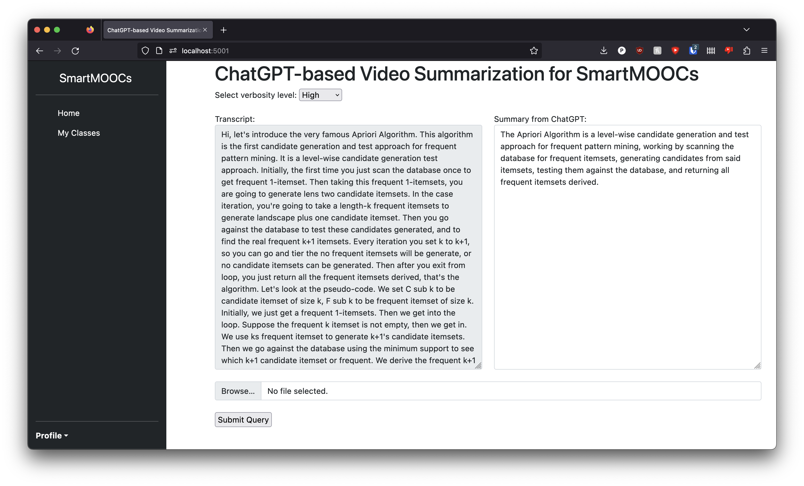

# chatgpt-video-summary
ChatGPT-based Video Summarization for SMARTMOOCs as part of CS 510 course project.

## Setup

### Requirements
- Docker
- Open AI account + API Key

### Build
- Build the application using Docker by executing `cd <workspace>` followed by `docker build . --tag chatgpt`
- Run the webapp by executing `docker run -p 5001:5000 -e "OPENAI_API_KEY=<your open ai key goes here>" -d chatgpt `
- Open `http://localhost:5001/` in your web browser

## Screenshots
